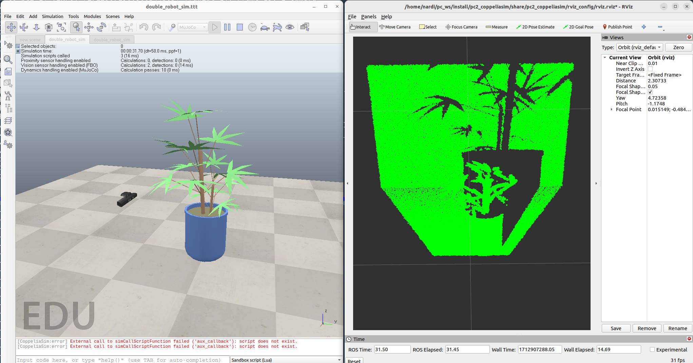

## PointCloud2 converter for CoppeliaSim


ROS2 porting and adaptation of [this](https://github.com/marco-teixeira/float32multiarray_to_pointcloud2.git) repository

This package reads the depth map data coming from 3D cameras in CoppeliaSim and convert them into a standard PointCloud2 message.



### Installation
Build the package in your ROS2 workspace
```
cd <path to your src folder in the ROS2 workspace>
git clone https://github.com/Hydran00/pc2-coppeliasim-ROS2.git
cd .. && colcon build --packages-select pc2_coppeliasim --symlink-install && source install/setup.bash
```
### Running
1. Open Coppeliasim and open the scene `stereo-camera.ttt` 
2. Run the node
```
ros2 launch pc2_coppeliasim pc2_coppeliasim.launch.py
```

### Camera parameters
If you want to modify the camera parameters in CoppeliaSim you then have to properly update also the same parameters in `pc2_coppeliasim.launch.py` file.

General parameters are:
- `frame_id`: frame in which the camera point cloud will be published 
- `input_topic`: name of the ROS2 topic where the depth map is published by CoppeliaSim
- `output_topic`: name of the ROS2 topic where the point cloud will be published
- `noise`: wheter to add Gaussian noise to the point cloud or not
- `color`: whether to add color to the point cloud or not
- `R`:  (ignored if `color` is set to false) red channel value (1-255)
- `G`:  (ignored if `color` is set to false) green channel value (1-255)
- `B`:  (ignored if `color` is set to false) blue channel value (1-255)
- `use_sim_time`: wheter the header timestamp should be the simulation time or the current time (this should always be set to true)  
Camera parameters are:
- `near_clip`
- `far_clip`
- `view_angle`
- `height`
- `width`